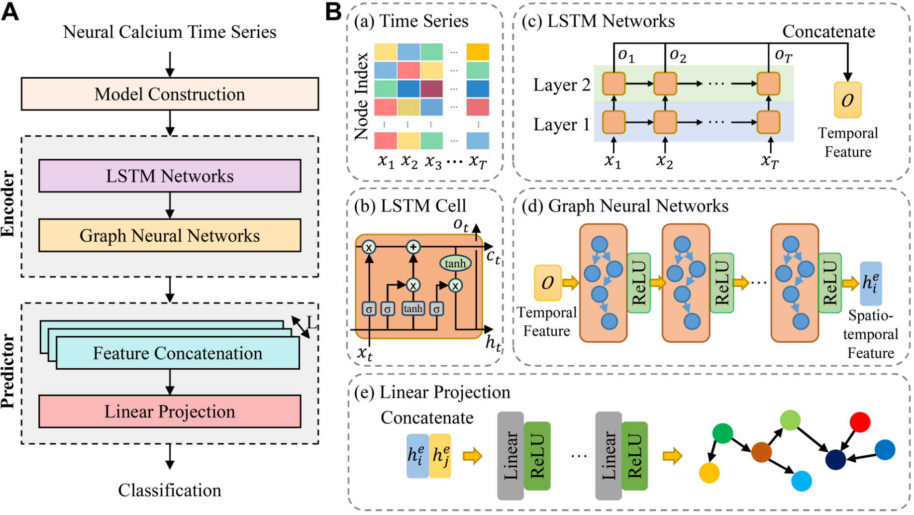

# C.-elegans-Neural-Connectivity-Prediction

## 1. Project File Descriptions

- **`config.py`**  
  Contains configuration settings for model design and training.

- **`graph_feat_prepare.py`**  
  Responsible for constructing the Graph Neural Network (GNN), and for data loading and preprocessing.

- **`modules.py`**  
  Includes the LSTM and GNN modules used in the model.

- **`process_data_of_Figure1_and_Table1.py`**  
  Processes experimental results and generates the plots for Figure 1 and Table 1.

- **`process_data_of_Table2.py`**  
  Processes experimental results and generates the plots for Table 2.

- **`run_gnn.py`**  
  The main program of the project; serves as the entry point for model training and testing.

- **`data/`**  
  Directory that stores neural connectivity files and calcium activity data.

## 2. Model Architecture Diagram

## 3. Environment Setup and Execution
name: link_prediction  
channels:  
  - pytorch
  - dglteam/label/th21_cu118
  - nvidia
  - defaults
  - https://repo.anaconda.com/pkgs/main  
  - https://repo.anaconda.com/pkgs/r  
dependencies:  
  - _libgcc_mutex=0.1=main
  - _openmp_mutex=5.1=1_gnu
  - blas=1.0=mkl
  - brotli-python=1.0.9=py310h6a678d5_9
  - bzip2=1.0.8=h5eee18b_6
  - ca-certificates=2025.2.25=h06a4308_0
  - certifi=2025.4.26=py310h06a4308_0
  - charset-normalizer=3.3.2=pyhd3eb1b0_0
  - cuda-cudart=11.8.89=0
  - cuda-cupti=11.8.87=0
  - cuda-libraries=11.8.0=0
  - cuda-nvrtc=11.8.89=0
  - cuda-nvtx=11.8.86=0
  - cuda-runtime=11.8.0=0
  - cuda-version=12.9=3
  - dgl=2.4.0.th21.cu118=py310_0
  - filelock=3.17.0=py310h06a4308_0
  - gmp=6.3.0=h6a678d5_0
  - gmpy2=2.2.1=py310h5eee18b_0
  - idna=3.7=py310h06a4308_0
  - intel-openmp=2023.1.0=hdb19cb5_46306
  - jinja2=3.1.6=py310h06a4308_0
  - ld_impl_linux-64=2.40=h12ee557_0
  - libcublas=11.11.3.6=0
  - libcufft=10.9.0.58=0
  - libcufile=1.14.0.30=4
  - libcurand=10.3.10.19=0
  - libcusolver=11.4.1.48=0
  - libcusparse=11.7.5.86=0
  - libffi=3.4.4=h6a678d5_1
  - libgcc-ng=11.2.0=h1234567_1
  - libgfortran-ng=11.2.0=h00389a5_1
  - libgfortran5=11.2.0=h1234567_1
  - libgomp=11.2.0=h1234567_1
  - libnpp=11.8.0.86=0
  - libnvjpeg=11.9.0.86=0
  - libstdcxx-ng=11.2.0=h1234567_1
  - libuuid=1.41.5=h5eee18b_0
  - llvm-openmp=14.0.6=h9e868ea_0
  - markupsafe=3.0.2=py310h5eee18b_0
  - mkl=2023.1.0=h213fc3f_46344
  - mkl-service=2.4.0=py310h5eee18b_2
  - mkl_fft=1.3.11=py310h5eee18b_0
  - mkl_random=1.2.8=py310h1128e8f_0
  - mpc=1.3.1=h5eee18b_0
  - mpfr=4.2.1=h5eee18b_0
  - mpmath=1.3.0=py310h06a4308_0
  - ncurses=6.4=h6a678d5_0
  - networkx=3.4.2=py310h06a4308_0
  - numpy=1.26.4=py310h5f9d8c6_0
  - numpy-base=1.26.4=py310hb5e798b_0
  - openssl=3.0.16=h5eee18b_0
  - pip=25.1=pyhc872135_1
  - psutil=5.9.0=py310h5eee18b_1
  - pysocks=1.7.1=py310h06a4308_0
  - python=3.10.16=he870216_1
  - pytorch=2.1.0=py3.10_cuda11.8_cudnn8.7.0_0
  - pytorch-cuda=11.8=h7e8668a_6
  - pytorch-mutex=1.0=cuda
  - pyyaml=6.0.2=py310h5eee18b_0
  - readline=8.2=h5eee18b_0
  - requests=2.32.3=py310h06a4308_1
  - scipy=1.15.2=py310h23a989f_1
  - setuptools=78.1.1=py310h06a4308_0
  - sqlite=3.45.3=h5eee18b_0
  - sympy=1.13.3=py310h06a4308_1
  - tbb=2021.8.0=hdb19cb5_0
  - tk=8.6.14=h39e8969_0
  - torchtriton=2.1.0=py310
  - tqdm=4.67.1=py310h2f386ee_0
  - typing_extensions=4.12.2=py310h06a4308_0
  - urllib3=2.3.0=py310h06a4308_0
  - wheel=0.45.1=py310h06a4308_0
  - xz=5.6.4=h5eee18b_1
  - yaml=0.2.5=h7b6447c_0
  - zlib=1.2.13=h5eee18b_1
  - pip:
      - annotated-types==0.7.0
      - contourpy==1.3.2
      - cycler==0.12.1
      - fonttools==4.57.0
      - joblib==1.4.2
      - kiwisolver==1.4.8
      - matplotlib==3.10.3
      - packaging==25.0
      - pandas==2.2.3
      - pillow==11.2.1
      - pydantic==2.11.4
      - pydantic-core==2.33.2
      - pyparsing==3.2.3
      - python-dateutil==2.9.0.post0
      - pytz==2025.2
      - scikit-learn==1.6.1
      - seaborn==0.13.2
      - six==1.17.0
      - threadpoolctl==3.6.0
      - typing-inspection==0.4.0
      - tzdata==2025.2  

  
